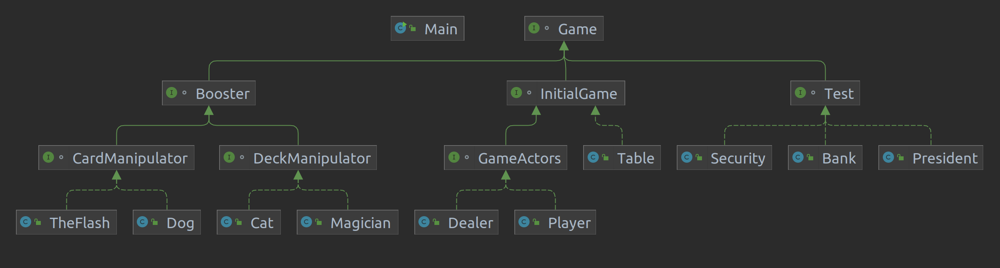

#Polymorphism

The Game class children are:
- InitialGame;
- Boosters;
- Test.

The InitialGame class children:
- GameActors;
- Table.

The GameActors class children:
- Dealer;
- Player.

The Boosters class children:
- CardManipulator;
- DeckManipulator;

The Test class children:
- President;
- Bank;
- Security.

The CardManipulator class children:
- Dog;
- TheFlash.

The DeckManipulator class children:
- Magician;
- Cat;

